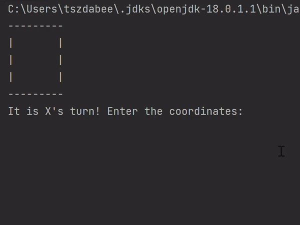

# Tic-Tac-Toe
A simple text-based two player tic tac toe game implemented in Java, runs in an IDE console environment.

Tic-tac-toe game is played on a 3 × 3 grid by two players, with alternating turns. The first player marks their move on the grid with an 'X', and the second with an 'O'. The first player to achieve three of their own marks (X or O) in a row either horizontally, vertically, or diagonally is the winner.

The code initializes the game grid, requests the user for the desired input coordinates (row#, col#) starting with the top left as (0 0) and ends at bottom right as (3 3). Players are alternated after every move until a draw or winner is reached.

## Demo
An sample playthrough of the game running in an IDE console environment is shown:

